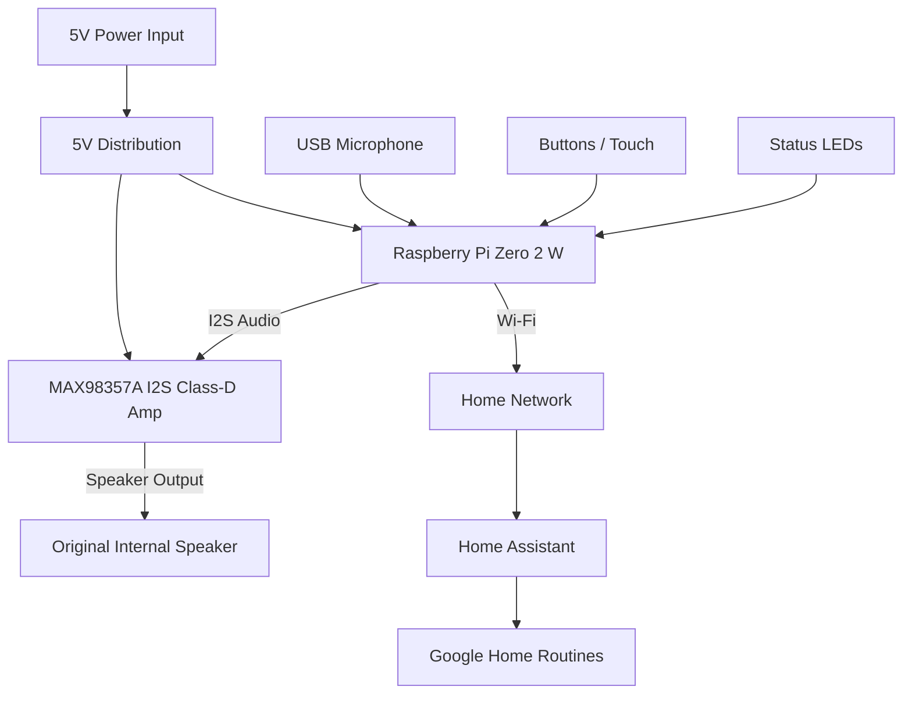

# NS-CSPGASP Speaker Rebuild  
**Pi Zero 2 W + MAX98357A I2S Amp**

## Objective

Replace the obsolete and unreliable Condor (Google Assistant) board with a fully controllable, future-proof system that:

- Retains similar loudness to the original speaker
- Supports:
  - Spotify playback
  - Voice control
  - Reliable timers and alarms
- Integrates with Google Home via Home Assistant (no official Assistant dependency)
- Reuses the existing enclosure and speaker
- Requires no reverse-engineering of the Condor PCB

---

## High-Level Architecture



---

## Design Rationale

### Why the Condor board is fully removed
- Speaker leads connect directly to Condor
- Amp, DAC, DSP, and SoC are tightly integrated
- No clean audio input points
- Secure boot prevents firmware replacement

Replacing it entirely is faster, cheaper, and more reliable.

---

### Why MAX98357A
- Combines DAC + Class-D amp in one chip
- Delivers ~3 W into 4 Ω @ 5 V
- Matches original practical loudness
- I2S input avoids analog noise
- Tiny footprint, low heat, inexpensive

---

## Bill of Materials

### Core Compute
| Item | Notes | Est. Cost |
|----|----|----|
| Raspberry Pi Zero 2 W | Wi-Fi + CPU | $15 |
| MicroSD card (16–32 GB) | OS + cache | $6 |

### Audio
| Item | Notes | Est. Cost |
|----|----|----|
| MAX98357A I2S amp breakout | DAC + amp | $4 |
| Existing internal speaker | Likely 4 Ω | $0 |

### Voice Input
| Item | Notes | Est. Cost |
|----|----|----|
| USB microphone (2-mic preferred) | Echo handling | $10–15 |

### Power & Wiring
| Item | Notes | Est. Cost |
|----|----|----|
| JST / Dupont wires | Internal wiring | $5 |
| Buck converter | If input >5 V | $2 (optional) |

Typical total: $35–45

---

## Electrical Wiring

### Power
```
5V Input
 ├── Pi 5V
 └── MAX98357A VIN
Grounds MUST be common
```

### I2S Audio (Pi → MAX98357A)
| Pi GPIO | Signal | MAX98357A |
|----|----|----|
| GPIO18 | BCLK | BCLK |
| GPIO19 | LRCLK | LRC |
| GPIO21 | DATA | DIN |
| 5V | Power | VIN |
| GND | Ground | GND |

### Speaker Output
```
MAX SPK+ → Speaker +
MAX SPK− → Speaker −
```

Do NOT connect speaker leads to ground.

---

## Physical Assembly Steps

1. Remove Condor board completely
2. Mount Pi Zero 2 W in enclosure
3. Mount MAX98357A close to speaker
4. Split 5 V power cleanly
5. Keep speaker leads short and twisted

---

## Software Stack

### Base OS
- Raspberry Pi OS Lite (64-bit)

### Audio
- ALSA + PipeWire
- Enable I2S in /boot/config.txt:
```
dtoverlay=hifiberry-dac
```

### Media
- spotifyd (Spotify Connect)

### Voice
- Wake word: Porcupine
- STT: Whisper.cpp
- TTS: Piper

### Automation
- Home Assistant
- REST / webhook triggers
- Google Home routines via HA

---

## Timers & Alarms
- Local scheduler (Python or systemd)
- Survives reboots
- No cloud dependency

---

## Expected Performance

| Feature | Original | Rebuild |
|----|----|----|
| Max loudness | ~90 dB | ~90 dB |
| Alarm reliability | ❌ | ✅ |
| Spotify | ✅ | ✅ |
| Voice control | ❌ | ✅ |
| Future support | ❌ | ✅ |

---

## Known Limits
- No official Google Assistant registration
- Google Home via Home Assistant bridge
- Simpler DSP than Google original

---

## Optional Enhancements
- LED status ring
- Capacitive touch controls
- Custom wake-word sounds
- 3D-printed mounting bracket
- Higher-sensitivity speaker
